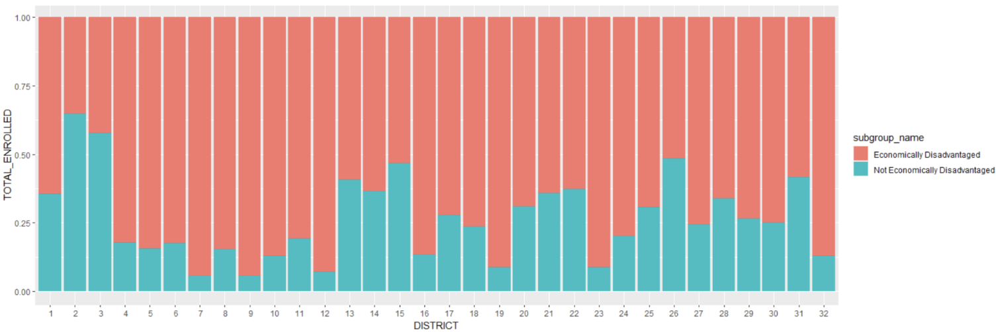

# NYC Regent Score Exploration in R

[Full Report](report.pdf)

## Abstract
Covid-19 had a huge impact on children, especially on education. Families in poor communities might not have the resources and technology for their child to succeed in learning while at home. These families also might have had a rough time dealing with finances and school wouldn’t have been a priority for them. Using data from the New York State Education Department on all the districts in NYC, compare scores prior to covid-19 to scores after for each district to see if there’s a significant difference between poor and rich districts and push for more funding in poor communities.

## Hypothesis / Goal
I hypothesize economically worse off schools would have less funding since NYC schools get some of its funding directly from its neighborhood property tax. Therefore, if a neighborhood is a slum and the buildings there aren’t worth as much, the school would get less funding as the government would collect less property taxes.  

## Data Collection
Find data on the regents scores scored and funding each school gets for the 32 NYC School Districts. Find which district is worse/better off economically and then compare the regent scores before and after Covid-19. 
* [Data on the regents scores scored and funding each school receives](https://data.nysed.gov/downloads.php)
* [Data on each district's economics](https://www.budget.ny.gov/schoolFunding/2021/new-york-city/index.html)

## Findings
The top two districts in NYC is District 2 and District 26. The question is why is this so. From the chart below we see that District 2 has more students not from economically disadvantaged families than economically disadvantaged families.

From the logistic regression below, we can see that there is a relationship between a student’s score and whether or not they are economically disadvantaged. As the score decreases, there is a higher chance that the students are economically disadvantaged.

Given that a Level 2 is below expectation, I used the calculated logistic regression to get the probability that a student who scored 590 was at an economical disadvantage. The result was pretty bad. There's an 86.18% probability that the students are at an economic disadvantage for 2019 and 77.5% for 2021 if they scored a 590. Given that Level 4 is above standard, I used the calculated logistic regression to get the probability that a student who scored 615 (around 4) and the result were pretty bad again. It is very unlikely for an economically disadvantaged student to do excellent in school. There is a 7.8% chance that a student of economic disadvantage will score 615 for 2019, but was better in 2021 at 19.22%, given the fact that not every school required their students to take the regent in 2021. 

## Conclusion 
A key take away from this project is that school funding in NYC doesn’t have a big impact on the student’s regent score and that whether the student is from an economically disadvantaged family has more impact. Through exploring with the researcher files from the New York State Education Department website, it is now clear why certain districts score better on the regents than others. Wealth of the child’s parents plays a huge part. If a child comes from a wealthy family that lives comfortably, they are more likely to score higher in comparison to kids from economically disadvantaged families. 

